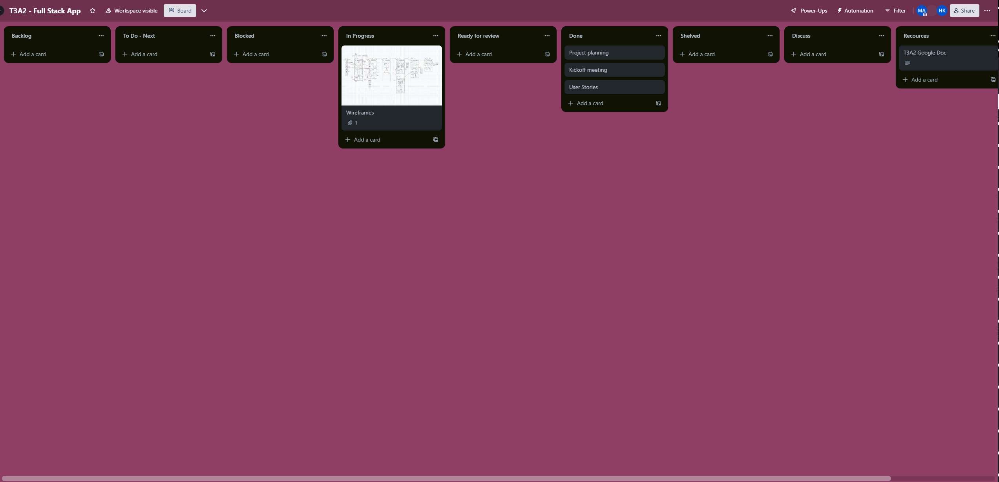

# T3A2-A - Full Stack App (Part A)

[Deployed website](https://main--relaxed-starlight-b535b4.netlify.app/)

[GitHub repository](https://github.com/Ruddoll/T3A2-FullStackApp)

## Description

In a post covid world with financial constraints and work from home habits we introduce an innovative solution, our proposal is an fitness app which is bound to revolutionize wellness journeys by allowing users to access a judgement free and financially sensitive app.

This advanced app directly addresses anxieties which linger due to judgment associated with first time/ struggling gym members by providing personal training tips, providing tailored workouts, expert nutrition guidance and a supportive community, users will be able to confidently progress in a judgment free environment.

Furthermore, by implementing personalized progress tracking, unconditional support and enriched gym experiences, our vision combines motivation and affordability. This proposal pushes for a fitness ecosystem which is nurturing to confidence and healthier lifestyles, our app will help grow your clientel by proving that your business are truly value the growth and security of their customers.

Our main target audience would be people who are aspiring gym members, current gym members and anyone who might need that extra push and support in truly feeling as they are in control of their health journey, as well as any gym bussiness who would want a quick and effective way to gain exposure for their products and classes. Some of the functionality and features that would be included in this app are:

- Class booking system which allows users to easily browse and book fitness classes based on their preferences and schedules.

- Personalized progress tracker which is possible because the app keeps records of users workout progress which ultimately helps users visualize their achievements over time.

- Tailored workout plans which are given to users according to their fitness goals, experience level and preferences.

- Nutrition guidance through personalized nutrition recommendations and meal plans which complement users fitness routines.

- Regularly updated fitness tips and advice to keep users engaged and motivated.

- User profiles which users can create profiles in order to track their fitness journey, manage bookings and view their progress history.

- Push notifications which show reminders for upcoming classes, personalized tips as well as motivational messages to keep users engaged.

- Payment integration so that users can securely make payments for classes, products or access to any premium features through the app.

The tech stack for this application will include:

- The MongoDB, Express.js, React, Node.js stack also known as the MERN stack, its known for its flexibility and efficiency and is a suitable choice when it comes to the development process of the app, the tech stack would involve:

- MongoDB which is a nosql database used for storing users profiles, fitness data, class schedules as well as other app related information.

- Express.js commonly known to be a backend framework for building APIs as well as handling server side operations such as user authentication and data management.

- React which is a frontend library which is used for creating interactive user interfaces that help produce a smooth/engaging experience for its users.

- Node.js, a runtime environment that works with server side scripting, allowing for an efficient handling of backend processes.

Other:
Redux which is a state management library for react which makes sure there is consistent data flow within the app, JWT also known as JSON Web Tokens, used to secure user authentication and authorization when accessing different app features, CSS framework such as bootstrap which is used in order to maintain a consistent and visually appealing design through out the app, Cloud Services for hosting the app, storing media files and or managing user authentication, a push notification service which is used to send timely notifications and updates to users, Version control such as git for managing codebase changes and maintaining a structured development process.

## Dataflow Diagram

In this Level 0 DFD, we have only included the major components and interactions such as:

User Interaction, since users interact with the frontend aspect of the app, accessing features such as class bookings, progress tracking as well as workout plans. Next is the frontend, frontend interfaces with the users and triggers api requests to the backend based on the users actions. API requests are user based interactions which communicate to the backend for many functionalities, Authentication and user profile setup is connected to the backend as it manages user authentication and user profile setup processes, the backend handles api requests like authentication and user profile setup.

## Application Architecture Diagram

words

## User Stories

ORM (Object-Relational Mapping) is a key component of this web server application. It provides several functionalities and benefits, including:

1. Sarah’s Transformation Journey

As a busy professional with a limited time and financial constraints, Sarah wants to stay committed to her fitness goals. She downloads our fitness app to access a variety of fitness classes that fit her schedule, including early morning and evening options. She selects classes like yoga and HIIT to target her specific fitness needs. The app’s personalised progress tracking helps Sarah see her improvements over time, boosting her motivation. The tailored workout plans and nutrition guidance make it easy for her to make healthier choices. With the app’s user-friendly interface, Sarah feels excited and engaged in her fitness journey, leading to consistent progress and a positive transformation.

2. John’s Budget-Friendly Fitness

John, a college student, is passionate about fitness but struggles with limited funds. He discovered our app through his local gym’s membership package. With the app, John can easily book affordable fitness classes that align with his class schedule. The tailored workout plans provide him with effective routines that maximise his results without requiring expensive equipment. The nutrition guidance helps him make smart dietary choices on a tight budget. By tracking his progress, John stays motivated to continue his fitness journey and achieve his goals, all while staying within his financial means.

3. Maria’s Motivated Motherhood

Maria is a new mom who finds it challenging to find time for herself amidst her busy parenting responsibilities. She signs up for her gym’s membership, which includes access to our fitness app. Maria loves the convenience of booking on-demand fitness classes that she can do at home while her baby naps. The app’s user-friendly interface allows her to seamlessly switch between workout plans tailored to postnatal fitness needs and access nutrition tips to regain her energy. With the app’s support, Maria feels empowered, motivated, and energised to prioritise her well-being while managing her motherhood responsibilities.

## Wireframes

Home: This is the main page that introduces your gym, its mission, vision, values, and services. It should also have a clear call to action to join the gym or book a class.

Classes: This page should list all the classes you offer, their schedules, prices, instructors, and descriptions. It should also allow visitors to book a class online or contact you for more information.

Progress: This page should allow members to log in and access their personal dashboard, where they can track their fitness goals, achievements, workouts, nutrition, and other metrics. It should also provide feedback and tips to help them improve their performance.

Tips: This page should offer valuable content for your audience, such as blog posts, videos, podcasts, newsletters, or ebooks on various topics related to fitness, health, wellness, and lifestyle. It should also encourage visitors to subscribe to your mailing list or follow you on social media.

About: This page should tell your story, your team, your facilities, your awards, your testimonials, and your partners. It should also highlight your unique selling proposition and what makes you different from other gyms.
Contact: This page should provide your location, phone number, email address, opening hours, and a contact form for visitors to get in touch with you. It should also include a map and directions to your gym.

## Trello board

